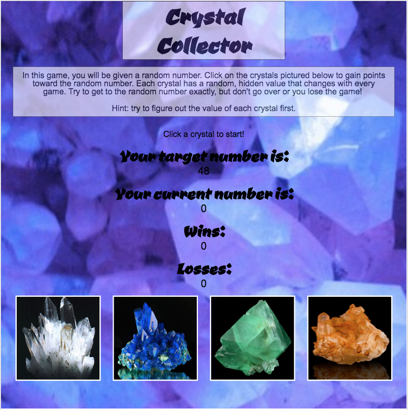

# Crystal Collector: The Game
This game was developed as a homework assignment for the UC Berkeley Extension Coding Program. It features HTML5, CSS3, and JavaScript. Users are given a value to meet. By clicking crystals with hidden values, their total increases. The goal is to meet, but not exceed the given value.

